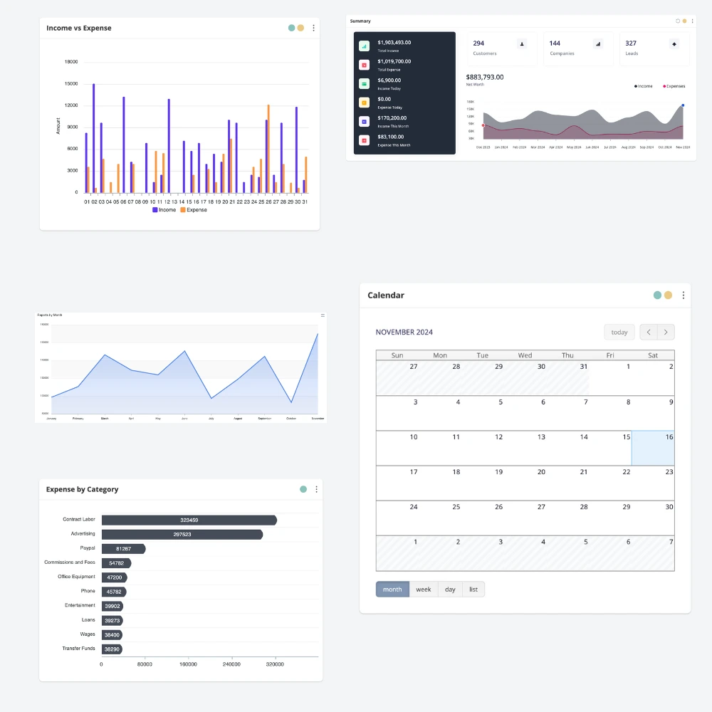

# Product Overview: FouzderIT Business Suite

FouzderIT Business Suite is a comprehensive, all-in-one software 
solution designed to help businesses streamline their operations, manage
finances, and improve customer relations. Whether you're a small 
business owner, freelancer, or part of a growing enterprise, FouzderIT 
brings together essential tools into a single, easy-to-use platform that
supports accounting, sales, project management, HR, and more.

# Core Modules

FouzderIT Business Suite’s core modules cover essential business functions, each designed to improve efficiency, accuracy, and visibility into different aspects of your operations.

### 1. Sales

The **Sales Module** supports your entire sales 
lifecycle—from lead generation to final invoicing. Generate quotes, 
manage customer data, and track sales orders and payments. This module 
helps businesses maintain clear records, automate sales tasks, and 
improve cash flow through prompt invoicing and payment tracking.

### 2. Purchases

The **Purchases Module** makes vendor management, 
purchase orders, and expense tracking seamless. Easily handle purchase 
orders, manage supplier details, and track bills. By organizing all 
purchasing activities in one place, this module keeps your expenses 
under control and simplifies expense reporting.

### 3. Accounting

FouzderIT’s **Accounting Module** offers comprehensive 
financial management tools, enabling you to track revenue, manage 
expenses, and maintain your financial records with precision. The 
accounting module provides a full view of your business’s financial 
health.

### Customer Relationship Management (CRM)

The **CRM Module** helps strengthen customer relations 
and manage interactions efficiently. Track leads, segment customers, 
manage tasks, and organize support tickets. By centralizing customer 
information and communications, this module ensures that you’re building
lasting relationships and providing responsive customer service.

### Project Management

For service-based businesses, the **Project Management Module** allows you to track project tasks, manage deadlines, and collaborate 
with team members. With tools for task assignment, time tracking, and 
project-based billing, this module is invaluable for keeping projects on
track and clients informed.

### HR and Payroll

The **HR and Payroll Module** simplifies human resources
tasks, from managing employee profiles and attendance to processing 
payroll. Generate payslips, track performance metrics, and maintain a 
full HR record, enabling efficient workforce management.

---

# Additional Features

### Reports and Analytics

Each module in FouzderIT includes powerful reporting tools, allowing 
you to generate detailed reports on sales, expenses, employee 
performance, and customer interactions. Use these insights to identify 
trends, optimize workflows, and make data-driven decisions that benefit 
your business.

### Multi-Currency and Multi-Language Support

FouzderIT supports multi-currency and multi-language functionality, 
making it an ideal solution for businesses with international clients or
operations.

### Customization and Integrations

Customize modules to fit your exact needs and integrate FouzderIT 
with third-party services for enhanced functionality. Customize invoice 
templates, set up automated reminders, configure user permissions, and 
more.

### Security and Permissions

Data security is a top priority. FouzderIT includes role-based 
permissions, allowing you to control who can access specific modules and
data. This security feature ensures that sensitive information is only 
accessible to authorized users.
