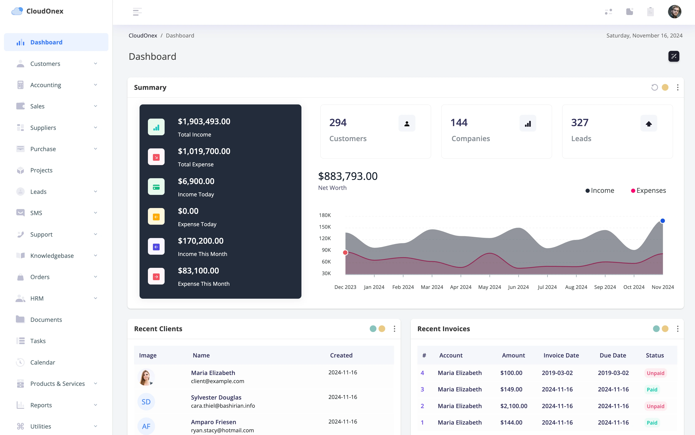

# Dashboard

The **Dashboard** is your control center, providing a high-level overview of your business’s key metrics and performance indicators. Here, you can monitor revenue, expenses, outstanding invoices, and much more in real-time. This centralized view allows you to track business health at a glance and quickly access detailed data in each module as needed.

 

# Key Modules and Their Functions

Each module in FouzderIT serves a specific purpose in managing your business operations. Below is an overview of each module and its main functions.

### 1. Sales Module

The **Sales Module** helps you manage the complete sales cycle, from lead generation to final invoicing. This module is essential for tracking revenue, managing customer relationships, and maintaining accurate records of all transactions.

#### Main Functions:

- **Quotes and Estimates**: Create quotes and estimates for prospective clients. Once approved, quotes can be easily converted into invoices.
- **Invoices**: Generate professional invoices and track payments. Use recurring invoices for subscription services.
- **Sales Orders**: Process sales orders to manage customer purchases and streamline the fulfillment process.
- **Customer Management**: Store customer information, transaction history, and communication logs, providing a 360-degree view of each client.
- **Payment Tracking**: Record received payments, track outstanding balances, and send reminders for overdue invoices.

### 2\. Purchases Module

The **Purchases Module** simplifies supplier management, purchase orders, and expense tracking. This module is vital for managing business expenses and ensuring timely payment to suppliers.

#### Main Functions:

- **Purchase Orders**: Create and manage purchase orders for vendors. Track order status and maintain records for inventory.
- **Supplier Management**: Store vendor details, contact information, and purchasing history, enabling efficient supplier relations.
- **Expenses**: Track and categorize all business expenses to monitor spending and manage cash flow effectively.
- **Bill Management**: Record and organize bills received from suppliers and vendors, ensuring timely payments.

### 3. Accounting Module

The **Accounting Module** provides essential tools to handle all aspects of your business’s finances, including revenue tracking, expense management, and comprehensive financial reporting.

#### Main Functions:

- **Transactions**: Record all transactions and track the financial health of your business with a complete view of income, expenses, assets, and liabilities.
- **Financial Reports**: Generate balance sheets, profit and loss statements, cash flow statements, and custom reports to gain insights into your financial position.

### 4. CRM (Customer Relationship Management) Module

The **CRM Module** is designed to strengthen customer relationships by organizing all interactions, tracking leads, and managing customer-related tasks.

#### Main Functions:

- **Lead Management**: Capture and organize leads, assigning them to team members and tracking progress through the sales pipeline.
- **Customer Segmentation**: Group customers based on preferences, purchase history, and other criteria for targeted marketing.
- **Task Management**: Assign tasks to team members to follow up on leads or manage customer inquiries.
- **Support Ticketing**: Provide customer support by organizing and tracking tickets submitted by clients for issues or service requests.

### 5. Project Management Module

The **Project Management Module** enables you to manage and track project tasks, deadlines, and team collaboration. Ideal for service-based businesses, this module ensures project deliverables are met on time and within budget.

### HR

The **HR and Payroll Module** helps manage employee information, track attendance, and process payroll. This module is essential for efficient human resource management.

### Main Functions:

- **Employee Records**: Store detailed employee profiles, including contact information, job roles, and employment history.
- **Attendance Tracking**: Record and monitor employee attendance and leave requests.